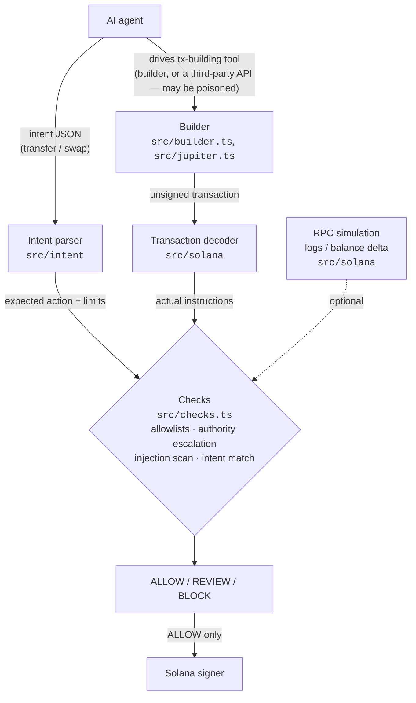

# AgentTx Firewall

**Live demo: [agenttxfirewall.vercel.app](https://agenttxfirewall.vercel.app/)**

Security middleware for AI agents holding Solana keys. Agents submit an intent — `transfer` or `swap` — rather than a signed transaction. The firewall builds the transaction independently, decodes whatever any transaction-building tool actually produces, and checks both against policy before signing.

## Architecture



The agent never receives a generic `sendTransaction`. Zero runtime dependencies.

## Installation

```bash
npm install
npm run build
```

## CLI

```bash
node dist/cli.js inspect transaction.json --policy policy.json
```

Produces a security report and exits `0` (ALLOW), `1` (BLOCK), or `2` (REVIEW). `--json` returns machine-readable output.

## SDK

```ts
import { AgentTxFirewall, JupiterSwapProvider, KeypairSigner } from "agenttx-firewall";

const signer = KeypairSigner.fromFile("./agent-keypair.json");
const firewall = new AgentTxFirewall({
  policy: {
    signer: signer.publicKey,
    destinations: { allow: [{ address: "<treasury>" }] },
    limits: { maxSolPerTx: "0.5", maxSolPerDay: "2" },
  },
  rpc: "mainnet",
  signer,
  swapProvider: new JupiterSwapProvider(),
});

const result = await firewall.execute(intent, { untrusted: toolOutput, trusted: userMessage });
```

`evaluateIntent()` builds and inspects without signing. `execute()` signs and sends on `ALLOW` only. `inspect(tx)` checks any raw transaction. `guard()` wraps an existing signer so it can only be used through the firewall.

## What is checked

| Check | Blocks when |
|---|---|
| Program / instruction allowlist | targets a program or instruction not in policy |
| Authority escalation | `approve`, `set_authority`, unlimited approvals |
| Destination / token allowlist | recipient or mint not in policy |
| Amount / slippage / priority fee | above configured limits |
| Matches declared intent | transaction does more than the intent said |
| Prompt-injection scan | untrusted text contains wallet-targeted instructions |
| Destination provenance | a non-allowlisted address appears only in untrusted content |
| Simulation | simulation error, dangerous CPI, balance drop above limit |

## Status

MVP, not audited. Live network paths (RPC, Jupiter) are covered by mocked tests, not live traffic. Static analysis sees top-level instructions only; injection detection is pattern-based, not a substitute for allowlists and intent-matching.

## License

MIT